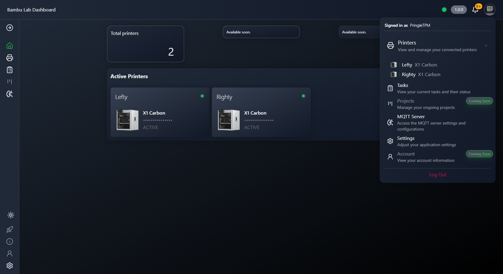
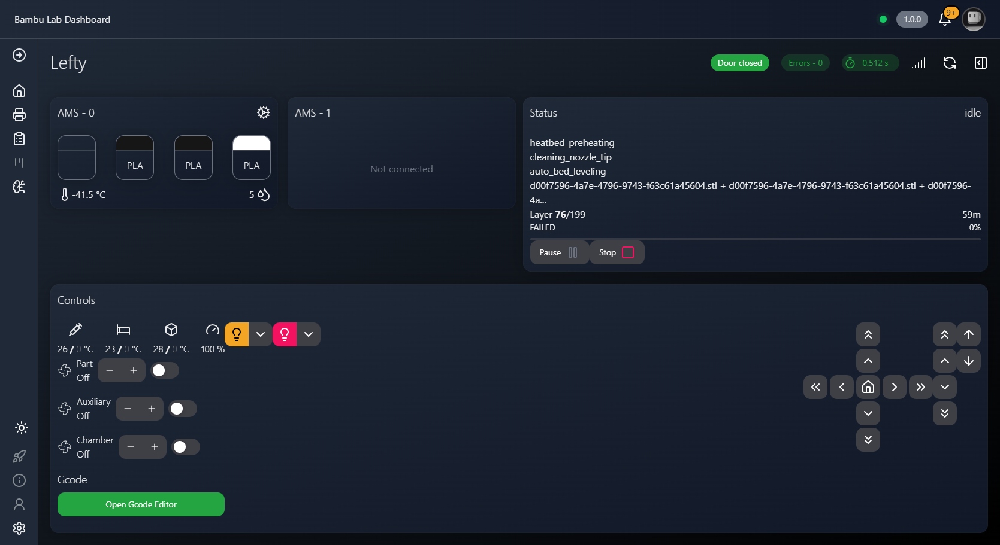
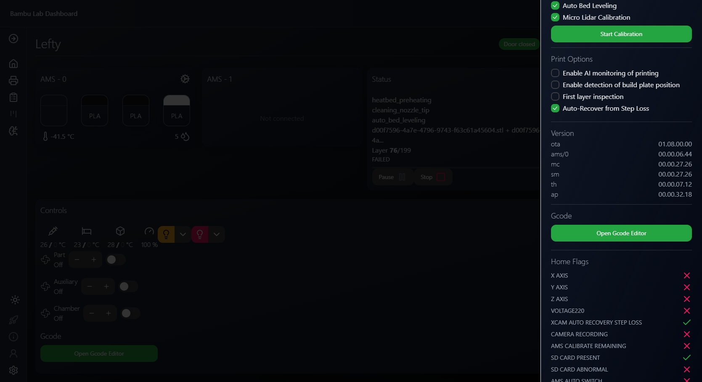
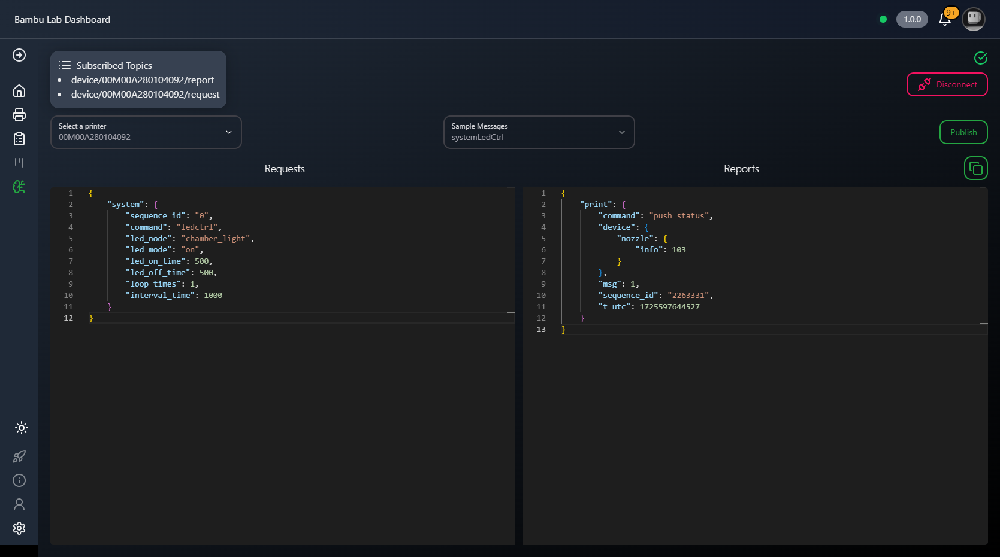

# Bambulab Dashboard

The Bambulab Dashboard is a real-time web application that connects to users' Bambulab 3D printers, 
providing live information and status updates from their printers. The dashboard subscribes to the 
printers via MQTT and displays key details, such as print progress, reports, and allows for sending 
commands directly to the device.

## Features

**Live Printer Monitoring**: Subscribe to your Bambulab 3D printers and monitor their status in real-time.



**Control Printer**: Send commands to your printer directly from the dashboard.





**MQTT Message Editor**: Edit and send custom MQTT messages to your devices.




## Installation
### Prerequisites
Before installing and running the Bambulab Dashboard, make sure you have the following software installed:

* [Bun](bun.sh) - A fast JavaScript runtime for server-side and front-end development.
* [Node.js](nodejs.org) - If not using Bun, you can use Node.js to run the application.

### Clone the Repository
Start by cloning the repository to your local machine:

```bash
git clone https://github.com/mohamedhadrami/bambulab-dashboard.git
cd bambulab-dashboard
```

### Install Dependencies
Use Bun to install all the required dependencies:

```bash
bun install
```

Alternatively, if you’re using Node.js, you can use `npm` or `yarn`:

```bash
npm install
# or
yarn install
```

## Running the Application
### 1. Start the Server
The Bambulab Dashboard requires a server to handle MQTT communication and WebSocket connections. You can start the server with the following command:

```bash
bun run server
```
This will initialize the server to handle communication between the dashboard and your Bambulab printer.

### 2. Start the Front-End Development Server
To run the development server and launch the dashboard:

```bash
bun run dev
```

This will start the development server, and you can access the application in your browser at http://localhost:3000.

### 3. Access the Dashboard
Once both the server and the front-end are running, open your browser and go to: http://localhost:3000
Here, you can connect your 3D printer, subscribe to the MQTT topics, and start receiving live updates from the device.

## Usage
1. **Connect to a Printer**: Select a 3D printer from the dropdown menu to start subscribing to live updates.
2. **View Subscribed Topics**: The dashboard will show all the topics you've subscribed to, including reports and requests.
3. **Publish Commands**: You can publish commands directly to your printer by selecting or editing a sample message from the editor.
4. **Monitor Real-time Reports**: The dashboard shows live updates from your printer, such as status reports, print progress, and more.

## Contributing
We welcome contributions to improve the Bambulab Dashboard! If you have any suggestions, feature requests, or bug reports, feel free to open an issue or create a pull request.

1. Fork the repository.
1. Create a feature branch (`git checkout -b feature/new-feature`).
1. Commit your changes (`git commit -am 'Add new feature'`).
1. Push to the branch (`git push origin feature/new-feature`).
1. Open a pull request.